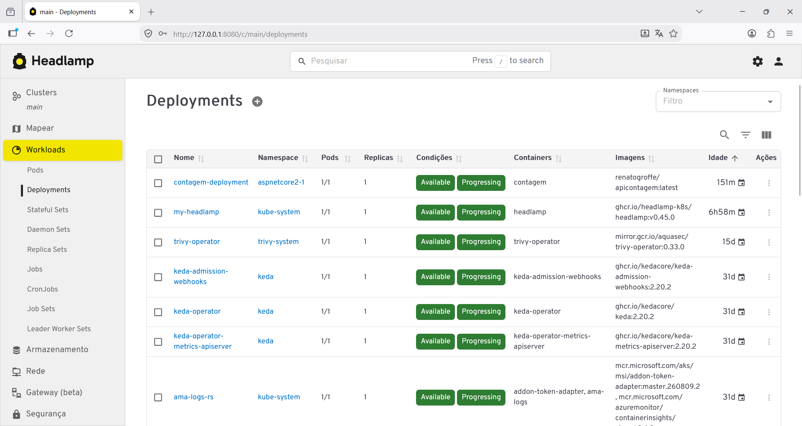

# headlamp-helmchart-kubernetes
Instruções para acesso de uma instância do Headlamp publicada em um cluster Kubernetes via chart Helm.

Acessando o Headlamp via browser:



## Criando uma Service Account para acesso ao Headlamp

Instrução que cria a Service Account:

```bash
kubectl -n kube-system create serviceaccount headlamp-admin
```

Configurar a Role para a Service Account:

```bash
kubectl create clusterrolebinding headlamp-admin --serviceaccount=kube-system:headlamp-admin --clusterrole=cluster-admin
```

## Gerando o token de acesso ao Headlamp

Instrução para gerar o token:

```bash
kubectl create token headlamp-admin --duration 24h -n kube-system
```

## Acesso via PowerShell
Script em PowerShell (arquivo headlamp-forward.ps1):

```pwsh
$POD_NAME = kubectl get pods `
    --namespace kube-system `
    -l "app.kubernetes.io/name=headlamp,app.kubernetes.io/instance=my-headlamp" `
    -o jsonpath="{.items[0].metadata.name}"

$CONTAINER_PORT = kubectl get pod `
    --namespace kube-system `
    $POD_NAME `
    -o jsonpath="{.spec.containers[0].ports[0].containerPort}"

Write-Host "Acesse http://127.0.0.1:8080 para usar o Headlamp..."

kubectl --namespace kube-system port-forward `
    $POD_NAME `
    "8080:$CONTAINER_PORT"
```

## Acesso via Bash
Script em Bash (arquivo headlamp-forward.sh):

```bash
export POD_NAME=$(kubectl get pods --namespace kube-system -l "app.kubernetes.io/name=headlamp,app.kubernetes.io/instance=my-headlamp" -o jsonpath="{.items[0].metadata.name}")
export CONTAINER_PORT=$(kubectl get pod --namespace kube-system $POD_NAME -o jsonpath="{.spec.containers[0].ports[0].containerPort}")
echo "Acesse http://127.0.0.1:8080 para usar o Headlamp..."
kubectl --namespace kube-system port-  forward $POD_NAME 8080:$CONTAINER_PORT
```
